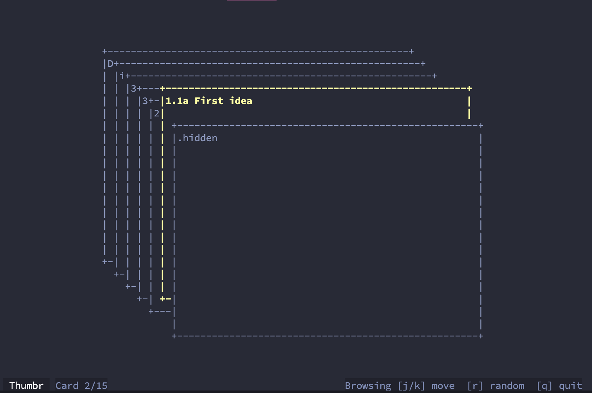

# Thumbr

**Thumbr** is a terminal note browser that lets you thumb through a stack of Markdown cards. It walks a directory of `.md` files, renders them as index cards in the terminal, and pulls the active card into an overlay for reading.



## Features
- **TUI Interface:** Built with Bubble Tea for a responsive terminal experience.
- **Smart Parsing:** Automatically parses filenames (e.g., `ID Title.md`) and renders Markdown.
- **Focus Mode:** Pull cards into an overlay to read long content without distraction.
- **Organization:** Mark important cards, toggle "marked-only" filters, and jump to random notes.
- **Obsidian Friendly:** Handles Obsidian-style links (`[[note]]`) cleanly.

## Requirements
- **Go 1.24+**

## Quick Start

### Run from Source
The fastest way to try Thumbr is using the included sample notes:

```bash
# Run with default sample notes
make run

# Or build and run manually
make build
./thumbr samples/notes
````

### Install/Run via Go

```bash
# Run directly on your current directory
go run ./cmd/thumbr .
```

## Usage

```
thumbr [options] [path]
```

- `path` is optional; defaults to the current working directory. Positional `path` beats the config file.
- Run `thumbr -h` to see all flags. `-v/--version` prints the embedded build version.

## Controls

Thumbr has two main interaction modes: the **Stack** (browsing files) and the **Overlay** (reading content).

### Navigation & Actions

| Context | Action | Keybindings | Notes |
| :--- | :--- | :--- | :--- |
| **Stack** | **Forward/In** | `k` / `Up` | Moves deeper into the stack. Accelerates with rapid presses. |
| **Stack** | **Back/Out** | `j` / `Down` | Moves back out of the stack. |
| **Stack** | **Random** | `r` | Jump to a random card. |
| **Stack** | **Mark Card** | `m` | Toggles mark (`*`). Unmarked cards dim if others are marked. |
| **Stack** | **Filter** | `t` | Toggle "Marked-Only" view. |
| **Overlay** | **Open/Close** | `Enter` | Opens active card / Closes overlay. |
| **Overlay** | **Scroll** | `j` / `k` | Scroll content line-by-line. |
| **Overlay** | **Page** | `n` / `p` | Next/Previous page (if content overflows). |
| **System** | **Help** | `?` / `h` | Shows current keybindings. |
| **System** | **Debug** | `d` | Toggle debug stats (counts, paging, nav metrics). |
| **System** | **Quit** | `q` / `Ctrl+c` | Quit app. (`Esc` also quits, or closes overlay if open). |

> **Note:** Keybindings can be customized via the configuration file.

## Configuration

Thumbr looks for a config file via the `--config` flag (supports JSON, YAML, TOML). Command line flags override config file values.

**Example:** `./thumbr --config config.example.json`

Precedence:

1. Positional path (if provided)
2. CLI flags
3. Config file values
4. Built-in defaults

Tip: copy `config.example.json` to `config.json` and adjust only the fields you care about.

### Configuration Options

| Category | Settings | Description |
| :--- | :--- | :--- |
| **Paths** | `noteRoot`, `includeExts`, `ignoreGlobs` | Define where notes live and what to skip. |
| **Display** | `altScreen`, `randomSeed` | Terminal screen settings. |
| **Styling** | `colorMark`, `colorMuted`, `borderCorner`... | Customize colors and border styles. |
| **Layout** | `stackVisible`, `cardWidthFrac`, `stackOffsetX` | Adjust geometry of the stack and cards. |
| **Navigation** | `pageStep`, `navAccelMs`, `navMaxStep` | Tune scrolling speed and acceleration physics. |
| **Bindings** | `bindUp`, `bindDown`, `bindQuit`... | Remap keys. |

See `config.example.json` for a full reference.

## Notes & Filename Parsing

  - **Discovery:** Directories are walked recursively. Markdown files are loaded by default.
  - **Ignoring Files:** Use `--ignore` or `ignoreGlobs` to skip paths (globs match basename or full path).
    - Patterns ending in `/*` act as directory ignores (e.g., `Archive/*` skips that folder).
  - **Filename Parsing:**
      - Files named `ID Title.md` (e.g., `1.1a Some idea.md`) are parsed into an **ID** and **Title**.
      - Files like `Draft.md` are treated as having a Title only (ID is empty).
  - **Rendering:**
      - Obsidian links (`[[Note]]` or `[[Note|Alias]]`) are cleaned and rendered as text.
      - Unreadable files are skipped gracefully.

## Flags at a Glance

- **Screen/behavior:** `--alt-screen` (default true) or `--no-alt-screen`; `--random-seed` for deterministic random jumps; `--page-step` to override half-page paging.
- **File selection:** `--include-exts=.md,.txt`; `--ignore=Archive/*,**/*.tmp`.
- **Navigation feel:** `--nav-accel-ms` (default 350ms) and `--nav-max-step` (default 8) control thumbing acceleration.
- **Layout:** `--stack-visible`, `--stack-offset-x/y`, `--card-width-frac`, `--card-height-frac`, `--active-lift-y`, `--max-cursor-depth` (how deep the active card can sit in the visible stack), `--sticky-overlay-nav` to keep overlay navigation active when jumping.
- **Styling:** `--color-*` for accents/status, `--border-corner`, `--border-h`, `--border-v`.
- **Keybindings:** `--bind-up/down/random/overlay/mark/filter/help/quit/page-next/page-prev/overlay-up/overlay-down` accept comma-separated keys; blank keeps defaults.

## Development

### Project Layout

  - `cmd/thumbr`: CLI entry point and Bubble Tea program initialization.
  - `internal/notes`: Card discovery, file parsing, and filtering logic.
  - `internal/ui`: The Bubble Tea model, input handling, rendering, and physics.
  - `samples/notes`: A test suite of notes (nested, hidden, long content) for smoke testing.

### Make Targets

Uses a local `.gocache` to keep your system clean.

  - `make run`: Build and run (defaults to `samples/notes`).
  - `make build`: Compile binary (embeds `git describe` version).
  - `make check`: Run lint (`go vet`) and tests.
  - `make test`: Run unit tests.
  - `make fmt`: Format code.
  - `make clean`: Remove artifacts.

### Docker

Thumbr includes a multi-stage Dockerfile for development and release.

**1. Development Shell**
Mounts your local source code into a container with tools installed.

```bash
docker build -t thumbr-dev --target dev .
docker run --rm -it -v "$PWD":/app -w /app thumbr-dev
```

**2. Release Image**
Builds a lightweight image for running Thumbr.

```bash
# Build
docker build -t thumbr --build-arg VERSION=$(git describe --tags --dirty --always) .

# Run (Mount your notes to /notes)
docker run --rm -v "$PWD/samples/notes":/notes thumbr /notes
```

## Roadmap / Known Gaps

  - Live vault/config reloading.
  - "Open in Editor" functionality.
  - Performance tuning for large vaults (target: 90k notes in \<2s).
  - Release pipelines (GoReleaser/Homebrew).
